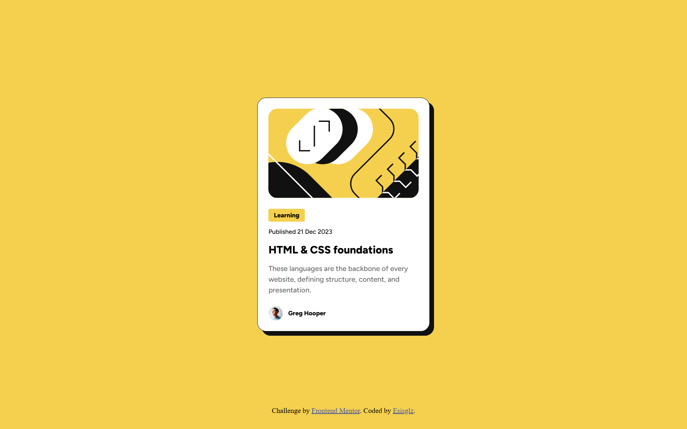

# Frontend Mentor - Blog preview card solution

This is a solution to the [Blog preview card challenge on Frontend Mentor](https://www.frontendmentor.io/challenges/blog-preview-card-ckPaj01IcS). Frontend Mentor challenges help you improve your coding skills by building realistic projects. 

## Table of contents

- [Overview](#overview)
  - [The challenge](#the-challenge)
  - [Screenshot](#screenshot)
  - [Links](#links)
- [My process](#my-process)
  - [Built with](#built-with)
  - [What I learned](#what-i-learned)
  - [Continued development](#continued-development)
- [Acknowledgments](#acknowledgments)


## Overview

### The challenge

Users should be able to:

- See hover and focus states for all interactive elements on the page

### Screenshot



### Links

- Solution URL: [Add solution URL here](https://your-solution-url.com)
- Live Site URL: [Add live site URL here](https://your-live-site-url.com)

## My process

### Built with

- Semantic HTML5 markup
- CSS custom properties
- Flexbox
- CSS Grid
- Mobile-first workflow

### What I learned

Ive learnt to use variables, filters and transitions in css a bit better :D

To see how you can add code snippets, see below:


```css
:root{
    --font-family: "Figtree", sans-serif;
    --text-preset1: 800 clamp(20px,2vw,24px)/1.5 var(--font-family);
    --text-preset2: 500 clamp(14px, 1.5vw, 16px)/1.5 var(--font-family);
    --text-preset3: 500 clamp(12px, 1.2vw, 14px)/1.5 var(--font-family);
    --text-preset3-bold: 800 clamp(12px, 1.2vw, 14px)/1.5 var(--font-family);
}

.card{
    border: 1.5px solid #111111;
    width: clamp(325px, 80%, 385px);
    padding: 24px;
    background-color: white;
    border-radius: 20px;
    box-sizing: border-box;
    filter: drop-shadow(10px 10px #111111);
    transition: filter 0.3s ease-in-out;
}

.card:hover{
    filter: drop-shadow(20px 20px #111111);
}
```

### Continued development

I would like to keep working in md for notes and vanilla html/css to gain mastery over layouts before moving onto sass and react
grasping the fundamentals of responsive and accessible design. 


## Acknowledgments

Honestly hats off to frontend mentor for providing these challenges. And as always, docs is king.
